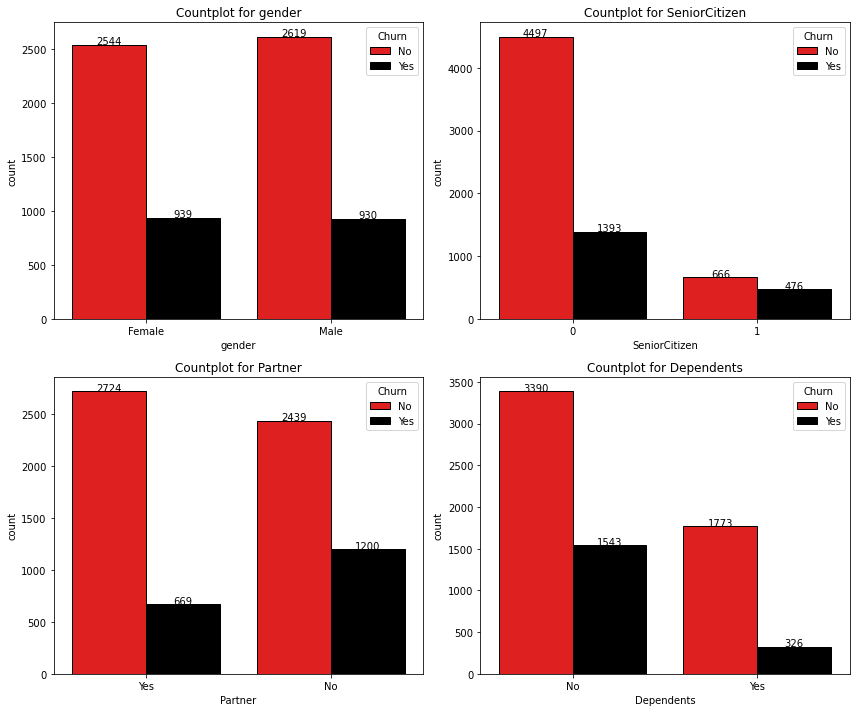
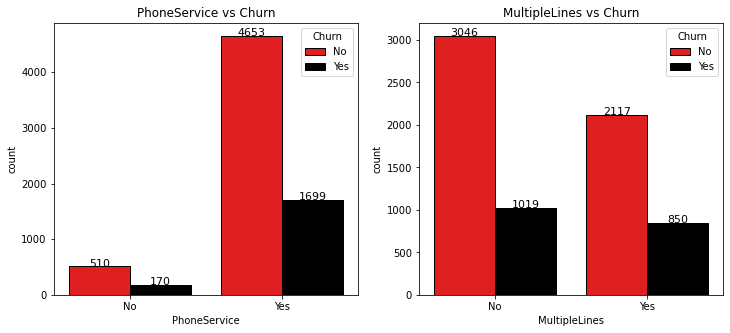
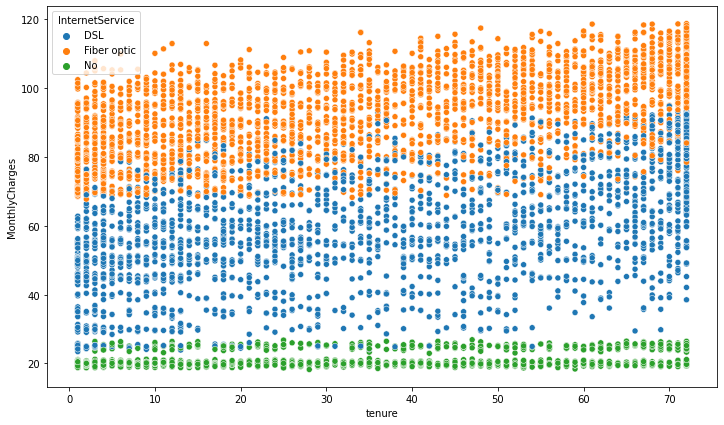
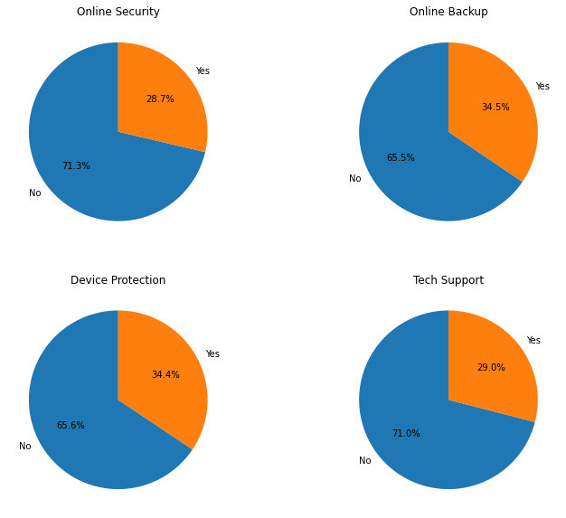
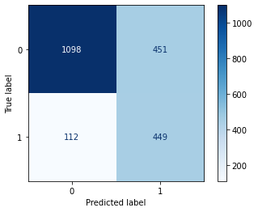

# SECURING LOYALTY: CUSTOMER CHURN PREDICTION IN TELCO

## Overview.

This project focuses on predicting customer churn using machine learning techniques. The goal is to build a model that effectively identifies customers at risk of churning, allowing businesses to implement proactive retention strategies.

## Business and Data Understanding

### Stakeholder Audience

The primary stakeholders for this project include business executives, marketing teams, and customer retention specialists. These stakeholders are interested in understanding customer churn patterns to optimize business strategies and enhance customer satisfaction.

### Dataset Choice

The dataset chosen for this project includes relevant features such as contract type, internet service, online security, and payment methods. The dataset is crucial for training machine learning models to predict customer churn accurately.

### Problem Statement

The telecom industry faces a critical challenge with customer churn, where users evaluate entire companies based on individual experiences. High churn rates, indicating customers discontinuing services, directly impact revenue. With the ubiquity of communication services, maintaining customer satisfaction is crucial. The anxiety-inducing nature of brief service disruptions emphasizes the need for effective churn analysis. Companies must develop predictive models and reports to gain insights, improve services, and implement targeted strategies, ultimately fostering customer trust and ensuring the industry's growth and success.

### Objectives

The general objective is to develop an effective and accurate classification model capable of predicting customer churn in order to assist in proactive customer retention strategies.

The specific objectives are:
1. Explore the Relationship Between Customer Churn, Demographic Information, and Account Details

2. Examine the Correlation Between Specific Services and Customer Churn

3. Develop a resilient classification model using appropriate algorithms for accurate prediction of customer churn.

## Exploratory Data Analysis (EDA)

### Churn Distribution Analysis

The EDA commenced with an insightful examination of churn distribution within the telecom dataset. Captured in a compelling pie chart, the analysis revealed a predominant presence of customers (73.4%) who have not experienced churn ("No"), while approximately 26.6% fall under the category of churned customers ("Yes"). This initial observation highlights a substantial proportion of customers currently maintaining their subscriptions.

However, the presence of churn at 26.6% signals a noteworthy aspect of customer attrition, emphasizing the need for a more in-depth exploration of underlying factors. It's crucial to note the imbalance in churn distribution, a facet that will be systematically addressed in subsequent analyses to ensure a comprehensive understanding of customer retention dynamics within the telecom service.

### Customer Characteristics and Churn

Building upon the churn distribution analysis, we delved into customer information, specifically exploring factors such as gender, senior citizenship, partnership, and dependence. The presented bar plots offer a nuanced perspective on how these variables intersect with churn dynamics.

Findings:
- Gender Distribution: The churn rates for male and female customers exhibit a noteworthy similarity, suggesting that gender alone may not be a significant predictor of churn.
- Senior Citizenship Impact: The proportion of senior citizen customers is relatively low. Approximately 40% of senior citizens experienced churn, accounting for 476 out of 1142 senior citizen customers. This indicates a higher churn rate within this demographic.
- Effect of Partnership: Customers with a partner showcase lower churn rates compared to those without a partner. This insight emphasizes the potential influence of partnership on customer retention.
- Dependents' Influence: Similarly, customers without dependents are more likely to churn. This suggests a correlation between family structure and churn behavior.

These initial observations provide a foundational understanding of how customer characteristics may influence churn.

### Service Subscriptions Impact

Expanding the exploratory analysis to service subscriptions, this phase scrutinizes the impact of various services on customer churn. Visualizations include scatter plots illustrating the relationship between tenure and monthly charges, as well as count plots and pie charts for different services.

Findings:
- Monthly Charges vs. Tenure: The scatter plot demonstrates a notable observation where customers with Fiber Optic internet service experience higher monthly charges compared to DSL users. Those with no service exhibit the least charges. This indicates a potential correlation between internet service type and associated costs.
- PhoneService and MultipleLines: Despite having no phone service, more customers were retained than those who opted for the service. The presence or absence of MultipleLines did not significantly affect the churn rate, suggesting this service may not be a major factor in customer decisions.

- Internet Service Preferences: Fiber optic service displays higher churn rates, possibly influenced by its associated higher monthly charges. On the contrary, DSL service attracts more customers, indicating a preference for this internet service.

- Streaming Services Impact: Both StreamingTV and StreamingMovies exhibit similar churn patterns. Regardless of subscription, a significant number of customers have churned. This implies that the availability of streaming content might not be the primary factor influencing customer decisions.

The examination of security and support services, including OnlineSecurity, OnlineBackup, DeviceProtection, and TechSupport, further illuminates the significance of these features in customer decision-making.

Findings:
- Online Security: The pie chart depicts that a considerable portion of customers (32.6%) lack Online Security services. This absence could contribute to an increased churn rate, emphasizing the importance of securing online activities.
- Online Backup: A notable 34.6% of customers do not have Online Backup services. This absence might contribute to the decision to switch service providers, underscoring the value customers place on data backup.
- Device Protection: The visualization indicates that 34.2% of customers do not utilize Device Protection services. The lack of protection for devices could be a factor influencing customer dissatisfaction and subsequent churn.
- Tech Support: A significant proportion (32.4%) of customers do not have access to Tech Support services. The absence of technical support may contribute to a higher churn rate, especially when customers face issues that remain unresolved.

These combined insights emphasize the multifaceted nature of customer churn dynamics. While internet service preferences and streaming options contribute to decision-making, the absence of critical security and support services emerges as a compelling factor in customer dissatisfaction. Telecommunications companies should prioritize enhancing Online Security, Online Backup, DeviceProtection, and Technical Support services to fortify customer relationships and reduce churn.

### Payment Methods and Contract Durations

The analysis of payment methods reveals a discernible impact on customer churn rates. Specifically, customers utilizing electronic checks exhibit higher churn rates compared to those opting for automated payment methods such as bank transfers or credit cards. This variance may be linked to factors like convenience and the perceived security of the chosen payment method. Understanding these nuances is crucial for tailoring retention strategies that address the specific concerns associated with different payment methods.

Exploring the relationship between contract duration and customer churn provides valuable insights. The visual representation, particularly for Month-to-Month contracts, highlights a notable increase in customer churn. This pattern suggests that customers opting for short-term contracts, possibly to explore varied services, are more prone to churning. The inclination to test services for a month, potentially for cost-saving reasons, contributes to the higher churn observed in this contract category.

Conclusion:
The intricate interplay between payment methods and contract durations significantly influences customer churn dynamics. Addressing the specific challenges associated with electronic check payments and tailoring strategies for customers on shorter-term contracts is imperative for effective retention. These insights guide the development of targeted interventions aimed at enhancing customer satisfaction and loyalty, ultimately contributing to a reduction in churn rates.

## Modeling

### Data Preprocessing

1. **Initial Dataset Cleanup:**
   The process initiated with the removal of 'customerID,' a column deemed extraneous for analysis, streamlining the dataset and eliminating unnecessary complexity. This decision enhances the dataset's focus on essential variables.

   An identified issue in the 'TotalCharges' column, where the data type was inconsistent, prompted a strategic conversion to numeric values. Simultaneously, null values in 'TotalCharges' were transformed to NaN (Not A Number), ensuring a standardized and coherent representation of numerical data.

2. **Handling Missing Values:**
   The recognition of the correlation between 'Tenure' and 'TotalCharges' prompted the careful deletion of 11 rows with null values in 'Tenure.' This decision, while minimizing the impact on the overall dataset, ensures data integrity by addressing missing values in a correlated context.

   **Reasoning:**
   Correlation-based Deletion: Deleting a small number of rows with missing 'Tenure' values aligns with the dataset's correlation structure, preserving overall data quality.

3. **Encoding Categorical Variables:**
   The transformation of categorical variables into numerical representations employed label encoding. This process facilitated the integration of categorical features into machine learning models.

   **Categorical Features Encoded:**
   - 'gender'
   - 'Partner'
   - 'Dependents'
   - 'PhoneService'
   - 'MultipleLines'
   - 'InternetService'
   - 'OnlineSecurity'
   - 'OnlineBackup'
   - 'DeviceProtection'
   - 'TechSupport'
   - 'StreamingTV'
   - 'StreamingMovies'
   - 'Contract'
   - 'PaperlessBilling'
   - 'PaymentMethod'
   - 'Churn'

4. **Feature Scaling:**
   Standardization of numerical features, such as 'Tenure,' 'MonthlyCharges,' and 'TotalCharges,' was performed using the Standard Scaler. This step ensures a consistent scale for input features, preventing any particular feature from dominating the machine learning models due to differences in magnitude.

5. **Handling Class Imbalance:**
   The recognition of class imbalance in the 'Churn' target variable prompted the implementation of the Synthetic Minority Over-sampling Technique (SMOTE). This technique artificially generates instances of the minority class ('Churn: Yes') to balance the class distribution, ensuring a more robust training process.

The exploratory data analysis (EDA) phase played a pivotal role in unraveling the complexities of customer churn dynamics. Utilizing visualizations and statistical summaries, this phase offered valuable insights into the distribution of churn, customer characteristics, service subscriptions, payment methods, and contract durations.

### Model Selection

1. **Baseline Model: Logistic Regression**
   - **Rationale:**
     Logistic Regression was chosen as the baseline model due to its simplicity and interpretability. This model provides a foundational understanding of the predictive power inherent in the dataset and serves as a benchmark for more complex models.

   - **Performance:**
     The baseline model exhibited satisfactory performance, achieving reasonable precision and recall values.

2. **Complex Models: Random Forest and XGBoost**
   - **Rationale:**
     Random Forest and XGBoost were selected as more complex models capable of capturing intricate relationships within the data. These models go beyond the linear assumptions of logistic regression, offering enhanced predictive capabilities.

   - **Performance:**
     Both Random Forest and XGBoost demonstrated superior performance compared to the baseline model. The comprehensive nature of these models allowed for a more nuanced understanding of customer churn patterns.

## Evaluation

Model evaluation involved a meticulous analysis of classification reports, precision, recall, F1 score, and the area under the ROC curve (AUC-ROC). The primary focus was on optimizing models for recall, considering the business context where identifying potential churners is of paramount importance.

1. **Logistic Regression Evaluation:**
   - **Recall Emphasis:**
     Recognizing the criticality of identifying customers at risk of churn, the logistic regression model was fine-tuned for enhanced recall. The precision-recall trade-off was carefully navigated to strike a balance between precision and recall while prioritizing the latter.

     

2. **Random Forest and XGBoost Evaluation:**
   - **Recall and Precision Optimization:**
     Both Random Forest and XGBoost models were refined to optimize recall without compromising precision. The iterative process of adjusting hyperparameters and leveraging feature importance insights facilitated the achievement of a balance between precision and recall.

   - **AUC-ROC Analysis:**
     The area under the ROC curve (AUC-ROC) was employed as an additional metric to assess the overall discriminative ability of the models. The values obtained indicated a high level of model performance in distinguishing between churn and non-churn instances.

## Model Deployment

The XGBoost model was deployed since it was the best model out of all the rest of the models.
The way to run this model localy is by running this line of code in the terminal `streamlit run app.py` and the app will give you links for you to be able to interact with the model

## Key Insights

The comprehensive analysis undertaken in this project has unearthed several key insights into customer churn dynamics within the telecom service:

1. **Customer Characteristics:**
   - Senior citizens exhibit a higher churn rate, indicating a potential need for targeted retention strategies for this demographic.
   - Customers without partners or dependents are more likely to churn, emphasizing the influence of family structures on retention.

2. **Service Subscriptions Impact:**
   - Internet service preferences play a crucial role, with Fiber Optic service showing higher churn rates.
   - Streaming services, while popular, do not significantly impact churn rates, suggesting other services play a more prominent role.

3. **Security and Support Services:**
   - Lack of Online Security, Online Backup, Device Protection, and Tech Support contributes to higher churn rates.
   - Strengthening these services is essential for improving customer satisfaction and reducing churn.

4. **Payment Methods and Contract Durations:**
   - Electronic check users exhibit higher churn rates, indicating potential issues with this payment method.
   - Month-to-Month contracts contribute significantly to churn, suggesting the need for strategies targeting short-term contract customers.

## Recommendations

Based on the key insights derived from the analysis, the following recommendations are proposed:

1. **Enhance Security and Support Services:**
   - Prioritize the improvement of Online Security, Online Backup, Device Protection, and Tech Support services to address key drivers of customer dissatisfaction and churn.

2. **Targeted Retention Strategies:**
   - Develop targeted retention strategies for senior citizens, customers without partners, and those without dependents to mitigate churn risks associated with these demographics.

3. **Evaluate Electronic Check Payment Issues:**
   - Investigate issues associated with electronic check payments leading to higher churn rates. Consider alternative payment methods or address concerns related to electronic check transactions.

4. **Address Short-Term Contract Challenges:**
   - Implement retention strategies specifically tailored for customers with Month-to-Month contracts to reduce the observed higher churn rates in this category.

5. **Continuous Monitoring and Adaptation:**
   - Regularly monitor customer preferences, industry trends, and evolving churn patterns to adapt the predictive models and retention strategies accordingly.

## Future Steps

While the current models demonstrate strong predictive capabilities, continuous monitoring and model refinement are recommended. As the business landscape evolves, periodic updates to the models will ensure sustained accuracy and relevance. Additionally, collaboration with domain experts can further enhance the interpretability of the models and the development of targeted retention strategies.

The evolving nature of customer preferences and industry trends necessitates an adaptive approach to churn prediction. Future iterations of this model should incorporate new data and adapt to emerging patterns, reinforcing its utility as a dynamic tool for customer retention.

## README Navigation

- [Overview](#overview)
- [Business and Data Understanding](#business-and-data-understanding)
  - [Stakeholder Audience](#stakeholder-audience)
  - [Dataset Choice](#dataset-choice)
- [Exploratory Data Analysis (EDA)](#exploratory-data-analysis-eda)
  - [Churn Distribution Analysis](#churn-distribution-analysis)
  - [Customer Characteristics and Churn](#customer-characteristics-and-churn)

